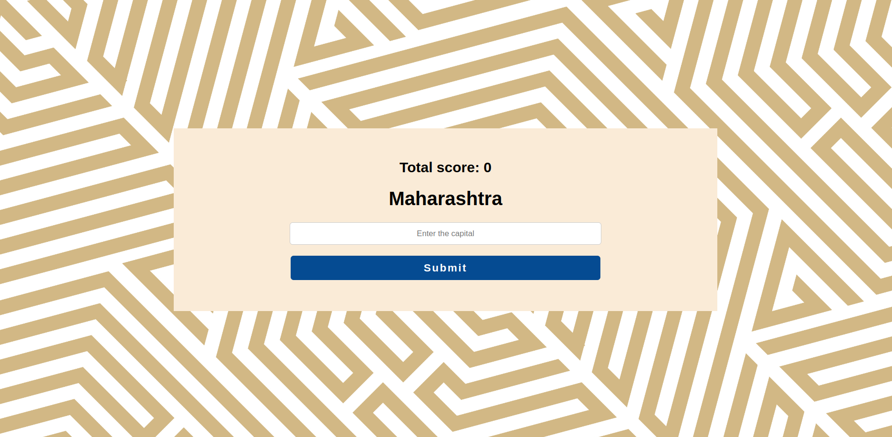

# Indian States Capitals Quiz

A web application that tests users' knowledge of Indian states and their capitals. Users are presented with the name of an Indian state and must enter the correct capital city to score points and advance to the next question.



## Features

- Interactive quiz on Indian states and their capitals
- Real-time score tracking
- Clean, responsive user interface with a distinctive geometric pattern background
- Backend validation of answers
- Database storage for states and capitals information

## Tech Stack

- **Frontend**: Express.js (template engine), HTML, CSS, JavaScript
- **Backend**: Node.js with Express.js
- **Database**: PostgreSQL
- **Architecture**: Simple Express.js application with database integration

## Installation

### Prerequisites

- Node.js (v14.x or higher)
- npm (v6.x or higher)
- PostgreSQL (v12.x or higher)

### Setup

1. Clone the repository
   ```bash
   git clone https://github.com/yourusername/indian-states-capitals-quiz.git
   cd indian-states-capitals-quiz
   ```

2. Install dependencies
   ```bash
   npm install
   ```

3. Set up environment variables
   Create a `.env` file in the root directory with the following variables:
   ```
   PORT=3000
   DB_USER=your_postgres_username
   DB_PASSWORD=your_postgres_password
   DB_HOST=localhost
   DB_PORT=5432
   DB_NAME=states_capitals_db
   ```

4. Set up the database
   ```bash
   psql -U your_postgres_username
   CREATE DATABASE states_capitals_db;
   \c states_capitals_db
   ```

5. Run the database initialization script
   ```bash
   npm run db:init
   ```
   Or manually create the tables:
   ```sql
   CREATE TABLE states (
     id SERIAL PRIMARY KEY,
     name VARCHAR(100) NOT NULL,
     capital VARCHAR(100) NOT NULL
   );
   
   INSERT INTO states (name, capital) VALUES
   ('Gujarat', 'Gandhinagar'),
   ('Maharashtra', 'Mumbai'),
   ('Tamil Nadu', 'Chennai'),
   -- Add all other Indian states and their capitals
   ;
   ```

6. Start the application
   ```bash
   npm start
   ```

7. Access the application at `http://localhost:3000`

## Project Structure

```
indian-states-capitals-quiz/
├── public/
│   ├── css/
│   │   └── style.css
│   ├── js/
│   │   └── script.js
│   └── images/
├── views/
│   └── index.ejs
├── db/
│   └── db.js
├── app.js
├── package.json
├── package-lock.json
├── .env
└── README.md
```

This is a simplified structure typical for a basic Express.js application. You can reorganize it based on your specific implementation.

## API Endpoints

- `GET /` - Renders the main quiz page
- `POST /submit` - Validates the user's answer and returns the next question
- `GET /api/states` - Returns a JSON list of all states (for development purposes)

## Database Schema

### States Table

| Column  | Type         | Description          |
|---------|--------------|----------------------|
| id      | SERIAL       | Primary Key          |
| name    | VARCHAR(100) | State name           |
| capital | VARCHAR(100) | Capital city name    |

## Usage

1. The application presents the user with an Indian state name
2. The user enters what they believe is the capital of that state
3. After clicking "Submit":
   - If correct: The score increases and the next question appears
   - If incorrect: The score remains unchanged and the next question appears
4. The quiz continues with different states

## Future Enhancements

- User authentication and persistent scores
- Timed quiz mode
- Difficulty levels (easy, medium, hard)
- Hints for difficult questions
- Leaderboard functionality
- Multiple choice options as an alternative mode
- Mobile app version

## Contributing

1. Fork the repository
2. Create your feature branch (`git checkout -b feature/amazing-feature`)
3. Commit your changes (`git commit -m 'Add some amazing feature'`)
4. Push to the branch (`git push origin feature/amazing-feature`)
5. Open a Pull Request


## Acknowledgements

- [Express.js](https://expressjs.com/)
- [Node.js](https://nodejs.org/)
- [PostgreSQL](https://www.postgresql.org/)
- [EJS](https://ejs.co/)